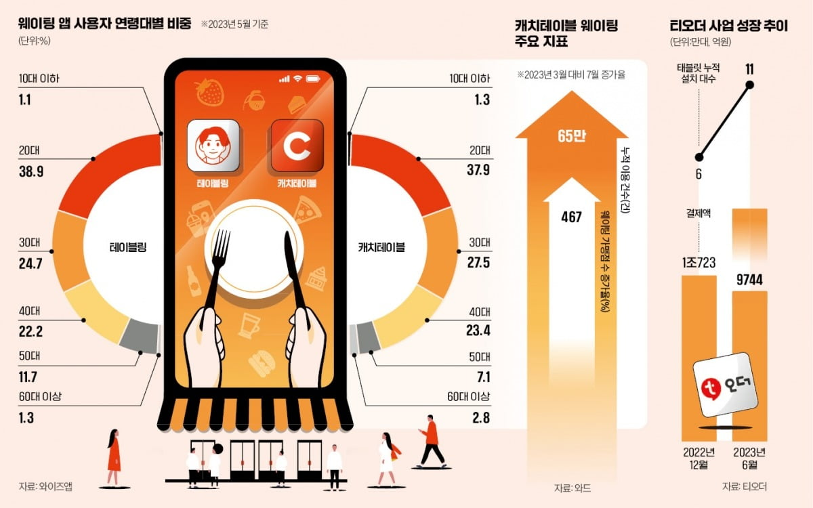
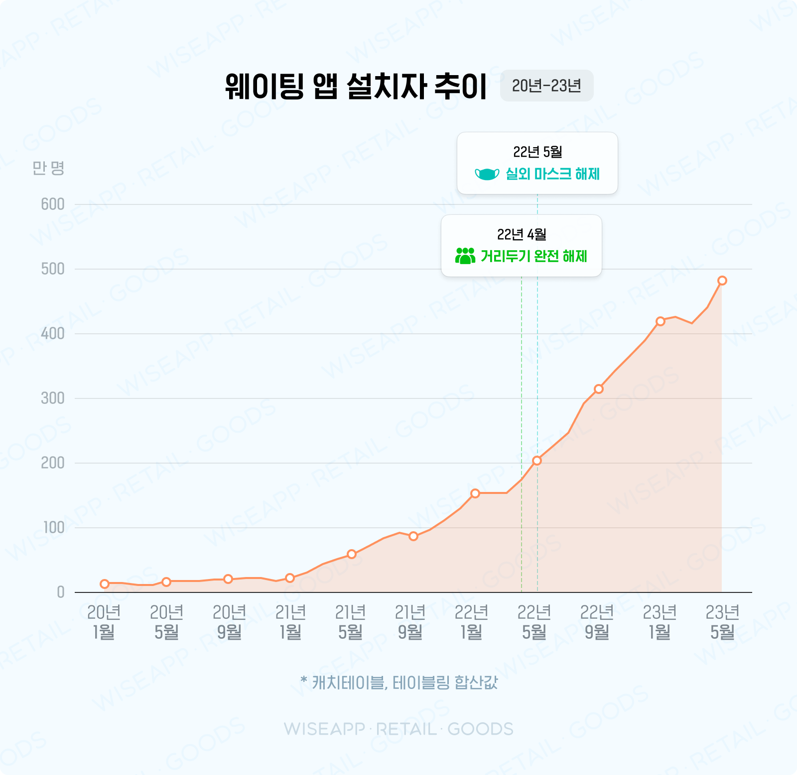

# ⏱프로젝트 개요
### 😃팀원소개
[정의진(25)](https://github.com/JungUiJin)

## 📽프로젝트 소개

‘웨이팅의 민족’은 사용자가 어플을 통해 ‘원격 줄서기’를 가능하게 도와주는 애플리케이션입니다. 사용자는 원하는 식당을 검색하고, 실시간으로 손쉽게 ‘원격줄서기(웨이팅)’을 할 수 있으며, 실시간으로 자신의 순번을 확인하고 자신의 차례가 되었을 시 식당에 들어갈 수 있습니다. 또한 가게에서 식사를 마친 후 가게에 대한 평점과 리뷰를 남길 수 있습니다. 이를 통해 사용자는 시간을 아끼고 간편하게 예약 후 식사를 즐길 수 있습니다.

## 📰프로젝트 필요성

코로나19 종식 이후 여행객이 나날이 증가함에 따라,  주요 관광지에 있는 ‘맛집’에 들르는 손님들이 많아지고 있습니다. 또한 ‘미식 문화’가 발전하며 사람들은 특정 맛집을 방문하기 위해 장시간 대기하는 것을 마다하지 않습니다.  이러한 현상 속에서 여행객은 맛집 방문 시 편리하게 대기할 수 있음을 원하고, 자영업자들은 보다 효율적으로 웨이팅을 관리할 방법을 찾고 있습니다. 

‘웨이팅의 민족’은 고객에게는 편리함을, 자영업자에게는 운영 효율성을 높여주며 여행 인구와 맛집 탐방 인구의 증가로 인해 높아진 수요를 충족시켜주는 데에 중요한 역할을 할 것입니다.

## 💻주요기능

- 맛집 검색하기
    - 태그(가게 특징)을 활용해서 맛집을 검색할 수 있습니다.
    - 웨이팅 수, 별점 수, 방문자 수, 가격대, 리뷰를 기준으로 맛집을 검색할 수 있습니다.
    - 맛집의 메뉴, 매장 정보를 확인할 수 있습니다.
- 웨이팅 등록하기
    - 예약자는 가게의 웨이팅 현황과 예상 대기시간을 확인할 수 있습니다.
    - 예약자는 인원수, 개인정보 등을 활용하여 웨이팅을 등록할 수 있습니다.
    - 예약자는 원하는 때에 예약을 취소할 수 있습니다.
    - 예약자는 예약이 등록되고, 가게 입장이 확정될 때 알림을 받을 수 있습니다.
- 웨이팅 관리하기
    - 자영업자는 현재 가게의 웨이팅 현황을 확인하고 상세 조회 할 수 있습니다.
    - 자영업자는 가게의 상태와 등록된 웨이팅을 고려하여 웨이팅 순번을 수정할 수 있습니다.

## 💬요구사항 명세

## 📅WBS

## 논리모델

## 물리모델 

## 🔗Replication
### Master-Slave Architecher

Master-Slave구조는 고가용성과 확장성을 위해 자주 사용되는 DB복제 메커니즘입니다. 하나의 데이터베이스 서버가 “Master” 역할을 하고, 하나 이상의 데이터베이스가 “Slave”역할을 합니다.  

- Master는 쓰기 작업(INSERT, UPDATE, DELETE)를 처리하며 모든 데이터 변경 사항이 Slave에게 전달됩니다.
- Slave는 Master로부터 데이터 변경 사항을 복제(Replication)받아 동일한 데이터 상태를 유지하며  읽기 작업(SELECT)를 처리하여 Master의 부하를 줄여줍니다.

### 연동 확인

- Click [영상 확인]

### Slave read-only 옵션 확인

- Click [영상 확인]

## ✅테스트케이스 문서

## 테스트게이스
➡[테스트케이스 바로가기](https://docs.google.com/spreadsheets/d/1_3g18QiK8ZDnau01V2Bv7JpF2u4-6OxWnLU3JCdR42Q/edit?usp=sharing)
## 테스트케이스 코드 및 실행

고객 회원 정보 관련 기능

    

1.회원기능

    

2.로그인

    

3.회원정보조회

    

4.회원정보수정

    

5.내가작성한리뷰조회

    

6.회원탈퇴

웨이팅 등록 관련 기능

    

1.웨이팅 등록

    

2.웨이팅 알림생성

    

3.웨이팅 확정

    

4.웨이팅 취소

음식점 정보 관련 기능

    

1.음식점 이름 검색

    

2.음식점 메뉴 검색

    

3.음식점 지역 검색

    

4.음식점 태그 검색

    

5.음식점 카테고리 검색

    

6.음식점 별점 순 정렬

    

7.음식점 실시간웨이팅 순 정렬

    

8.음식점 평균가격순 순 정렬

    

9.음식점 신규등록순 순 정렬

## 주요 쿼리

## 🏁회고록

| 팀 원 | 회고록 |
| --- | --- |
| 정의진 |  |
| 전아영 |  |
| 이성민 |  |
| 이창윤 |  |
| 박상현 |  |
| 남가람 |  |
