# ⏱프로젝트 개요
### 😃팀원소개
| 정의진 | 전아영 | 이성민 | 이창윤 | 박상현 | 남가람 |
| --- | --- | --- | --- | --- | --- |
| [깃 링크](https://github.com/JungUiJin) | [깃 링크](https://github.com/AYeong-Jeon) | [깃 링크](https://github.com/sungmini9755) | [깃 링크](https://github.com/leebackcoding) | [깃 링크](https://github.com/SANGHYUN0519) | [깃 링크](https://github.com/catnine11) |

## 📽프로젝트 소개

‘웨이팅의 민족’은 사용자가 어플을 통해 ‘원격 줄서기’를 가능하게 도와주는 애플리케이션입니다. 사용자는 원하는 식당을 검색하고, 실시간으로 손쉽게 ‘원격줄서기(웨이팅)’을 할 수 있으며, 실시간으로 자신의 순번을 확인하고 자신의 차례가 되었을 시 식당에 들어갈 수 있습니다. 또한 가게에서 식사를 마친 후 가게에 대한 평점과 리뷰를 남길 수 있습니다. 이를 통해 사용자는 시간을 아끼고 간편하게 예약 후 식사를 즐길 수 있습니다.

## 📰프로젝트 필요성

코로나19 종식 이후 여행객이 나날이 증가함에 따라,  주요 관광지에 있는 ‘맛집’에 들르는 손님들이 많아지고 있습니다. 또한 ‘미식 문화’가 발전하며 사람들은 특정 맛집을 방문하기 위해 장시간 대기하는 것을 마다하지 않습니다.  이러한 현상 속에서 여행객은 맛집 방문 시 편리하게 대기할 수 있음을 원하고, 자영업자들은 보다 효율적으로 웨이팅을 관리할 방법을 찾고 있습니다. 

‘웨이팅의 민족’은 고객에게는 편리함을, 자영업자에게는 운영 효율성을 높여주며 여행 인구와 맛집 탐방 인구의 증가로 인해 높아진 수요를 충족시켜주는 데에 중요한 역할을 할 것입니다.

## 💻주요기능

- 맛집 검색하기
    - 태그(가게 특징)을 활용해서 맛집을 검색할 수 있습니다.
    - 웨이팅 수, 별점 수, 방문자 수, 가격대, 리뷰를 기준으로 맛집을 검색할 수 있습니다.
    - 맛집의 메뉴, 매장 정보를 확인할 수 있습니다.
- 웨이팅 등록하기
    - 예약자는 가게의 웨이팅 현황과 예상 대기시간을 확인할 수 있습니다.
    - 예약자는 인원수, 개인정보 등을 활용하여 웨이팅을 등록할 수 있습니다.
    - 예약자는 원하는 때에 예약을 취소할 수 있습니다.
    - 예약자는 예약이 등록되고, 가게 입장이 확정될 때 알림을 받을 수 있습니다.
- 웨이팅 관리하기
    - 자영업자는 현재 가게의 웨이팅 현황을 확인하고 상세 조회 할 수 있습니다.
    - 자영업자는 가게의 상태와 등록된 웨이팅을 고려하여 웨이팅 순번을 수정할 수 있습니다.

## 💬요구사항 명세
➡[요구사항명세 바로가기](https://drive.google.com/file/d/1GMWnQc-rdHaP2VyZJ57iuRzzB0-1z4wF/view?usp=drive_link)
## 📅WBS
➡[WBS 바로가기](https://drive.google.com/file/d/1YshgVSAn2EP7PxG_mM6aGX_Rn0CZDHiQ/view?usp=drive_link)
## 논리모델
- 초기
.png)
- 최종
.png)
## 물리모델 
.png)

## 테이블 정의서
➡[테이블정의서 바로가기](https://drive.google.com/file/d/1lxyl6VMtoPj4RXdAzY3h8CcjOe12qXSO/view?usp=drive_link)
## 🔗Replication
### Master-Slave Architecher

Master-Slave구조는 고가용성과 확장성을 위해 자주 사용되는 DB복제 메커니즘입니다. 하나의 데이터베이스 서버가 “Master” 역할을 하고, 하나 이상의 데이터베이스가 “Slave”역할을 합니다.  

- Master는 쓰기 작업(INSERT, UPDATE, DELETE)를 처리하며 모든 데이터 변경 사항이 Slave에게 전달됩니다.
- Slave는 Master로부터 데이터 변경 사항을 복제(Replication)받아 동일한 데이터 상태를 유지하며  읽기 작업(SELECT)를 처리하여 Master의 부하를 줄여줍니다.

### 연동 확인
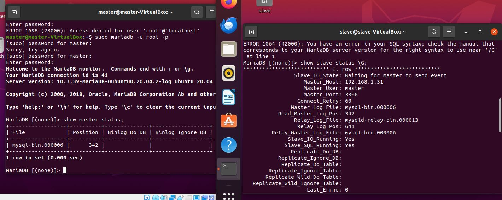
### 외부 PC 접속
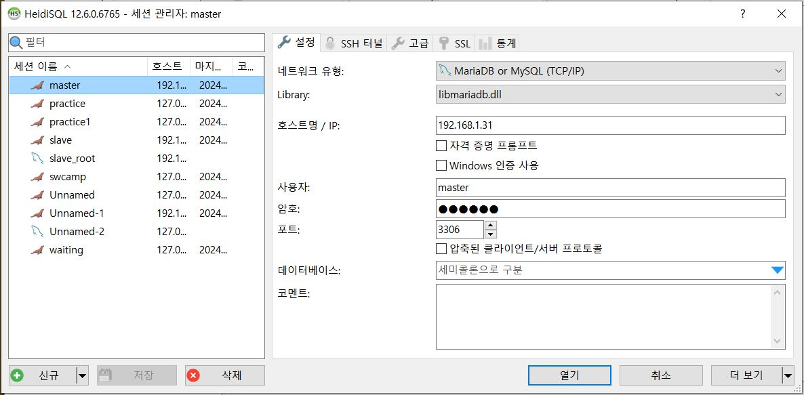
### Slave read-only 옵션 확인
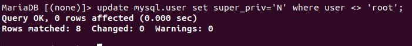

## ✅테스트케이스 문서

## 테스트케이스
➡[테스트케이스 바로가기](https://drive.google.com/file/d/1ZKG5vFPU19yQFKOOYlr_OJLSqKaby2-I/view?usp=drive_link)
## 테스트케이스 코드 및 실행

고객관련기능

    

    
고객 회원 정보 관련 기능

        

        
1. 회원가입

            
        

        

            
2. 로그인

            
        

        

            
3. 아이디 찾기

            
        

        

            
4. 임시 비밀번호 발급 및 재로그인

            
        

        

            
5. 회원정보 조회

            
        

        

            
6. 회원정보 수정

            
        

        

            
7. 내 웨이팅 내역 전체 조회

            
        

        

            
8. 내가 쓴 리뷰 조회

            
        

        

            
9. 내가 쓴 리뷰 수정

            
        

        

            
10. 내가 쓴 리뷰 삭제

            
        

        

            
11. 회원 탈퇴

            
        

    

    

    
웨이팅 등록 관련 기능

        

1.웨이팅,알람 등록

            
        

            

2.웨이팅확정

            
        

            

3.웨이팅취소

            
        

    

    

    
음식점 정보 조회 관련 기능

    

        

1.음식점이름검색

            
        

        

2.음식점메뉴검색

            
        

        

3.음식점주소검색

            
        

        

4.음식점태그검색

            
        

        

5.음식점카테고리검색

            
        

            

6.음식점별점순정렬

        
        

        

7.음식점리뷰순정렬

            
        

        

8.음식점웨이팅순정렬

            
        

        

9.음식점평균가격순정렬

            
        

        

10.음식점신규등록순정렬

            
        

    

    

    

    
음식점 상세 정보 조회 관련 기능

        

1.음식점상세정보조회

            
        

        

2.음식점메뉴상세정보조회

            
        

        

3.음식점전체리뷰조회

            
        

        

4.음식점사진포함리뷰조회

            
        

        

5.음식점리뷰별점순조회

            
        

        

6.음식점리뷰시간순조회

            
        

    

    

    
음식점리뷰작성기능

        

1.리뷰별점체크

            
        

        

2.음식점입장유무체크

            
        

        

3.음식점리뷰작성

            
        
   
    

자영업자관련기능

    

    
음식점 메뉴 관련 기능

        

            
1. 음식점 메뉴 그룹 등록

            

                
1. 음식점 메뉴 그룹 이름 중복 등록

                
            

            

                
2. 음식점 메뉴 그룹 이름 필수 테스트

                
            

            

                
3. 음식점 메뉴 그룹 설명 NULL 테스트

                
            

        

        

            
2. 음식점 메뉴 그룹 목록 초기 조회

            
        

        

            
3. 음식점 메뉴 그룹 목록 이름순 정렬 조회

            
        

        

            
4. 음식점 메뉴 그룹 목록 이름순 반대 정렬 조회

            
        

        

            
5. 음식점 메뉴 그룹 수정

            
        

        

            
6. 음식점 메뉴 그룹 삭제

            
        

        

            
7. 음식점 사진 미포함 메뉴 등록

            
        

        

            
8. 음식점 사진 포함 메뉴 등록

            
        

        

            
9. 음식 메뉴 전체 최초 조회

            
        

        

            
10. 메뉴 그룹 이름으로 메뉴 목록 정렬 조회

            
        

        

            
11. 메뉴 그룹 이름으로 메뉴 목록 반대 정렬 조회

            
        

        

            
12. 메뉴 이름으로 메뉴 목록 정렬 조회

            
        

        

            
13. 메뉴 이름으로 메뉴 목록 반대 정렬 조회

            
        

        

            
14. 오래된 순으로 메뉴 목록 정렬 조회

            
        

        

            
15. 최신 순으로 메뉴 목록 정렬 조회

            
        

        

            
16. 음식점 메뉴 상세 조회

            
        

        

            
17. 사진 수정 미포함 메뉴 수정

            
        

        

            
18. 사진 수정 포함 메뉴 수정

            
        

        

            
19. 음식점 메뉴 삭제

            
        

    

    

        
음식점 정보 관리 기능

        

        
1. 같은 업종의 음식점 찾기

            
        

        

            
2. 다른 가게 오픈시간 조회

            
        

        

            
3. 등록된 자신의 음식점 조회

            
        

        

            
4. 사업자 등록증 등록

            
        

        

            
5. 사진 조회

            
        

        

            
6. 음식점 삭제

            
        

        

            
7. 음식점 상세등록

            
        

        

            
8. 자신의 음식점 공지사항 수정

            
        

        

            
9. 자신의 음식점 공지사항 조회

            
        

        

            
10. 자신의 태그 조회

            
        

        

            
11. 자영업자 공지사항 삭제

            
        

        

            
12. 자영업자 사진 등록

            
        

        

            
13. 자영업자 알림 등록

            
        

        

            
14. 자영업자 정보 수정

            
        

        

            
15. 자영업자 태그 등록

            
        

        

            
16. 자영업자 회원가입

            
        

    

    

        
웨이팅 예상 대기시간 기능

        

            
1. 오늘의 대기시간 분석

            
        

        

            
2. 시간대별 예상대기시간

            
        

        

            
3. 요일, 시간대별 예상대기시간-프로시저

            
        

        

            
4. 요일, 시간대별 예상대기시간-함수

            
        

    

    

        
웨이팅 목록 조회

        

            
1. 웨이팅 목록 조회

            
        

        

            
2. 웨이팅 인원 조회

            
        

    

    

        
웨이팅 목록 조회

        

            
1. 웨이팅 목록 조회

            
        

        

            
2. 웨이팅 인원 조회

            
        

    

    

        
음식점 전체 리뷰 조회, 정렬

        

            
1. 최신순-기본- 조회

            
        

        

            
2. 별점순 조회

            
        

    

    

        
리뷰 별점 조회

        

            
1. 평균 별점 조회

            
        

        

            
2. 별점 별 리뷰수 조회

            
        

    

    
관리자 관련 기능

    

        
관리자 로그인 체크 

        
    

    
  
        
회원정보관리

        

1.고객정보조회

            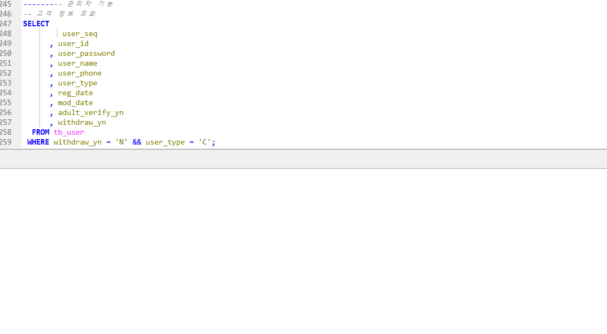
            

        

2.탈퇴한고객정보조회

            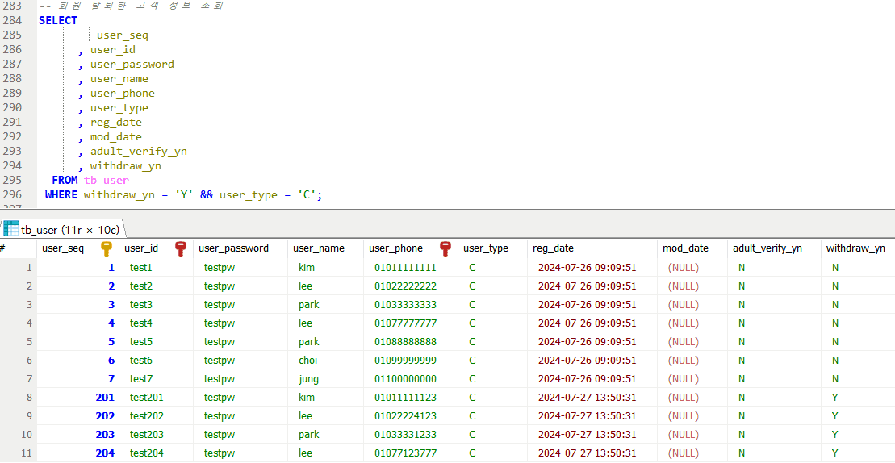
        

        

3.자영업자정보조회

            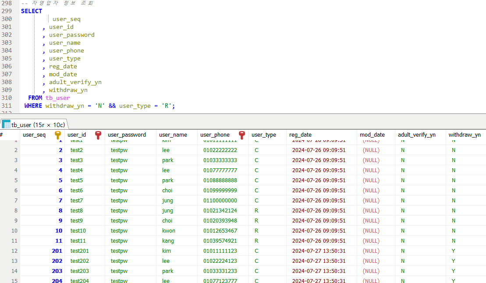
        

        

4.탈퇴한자영업자조회

            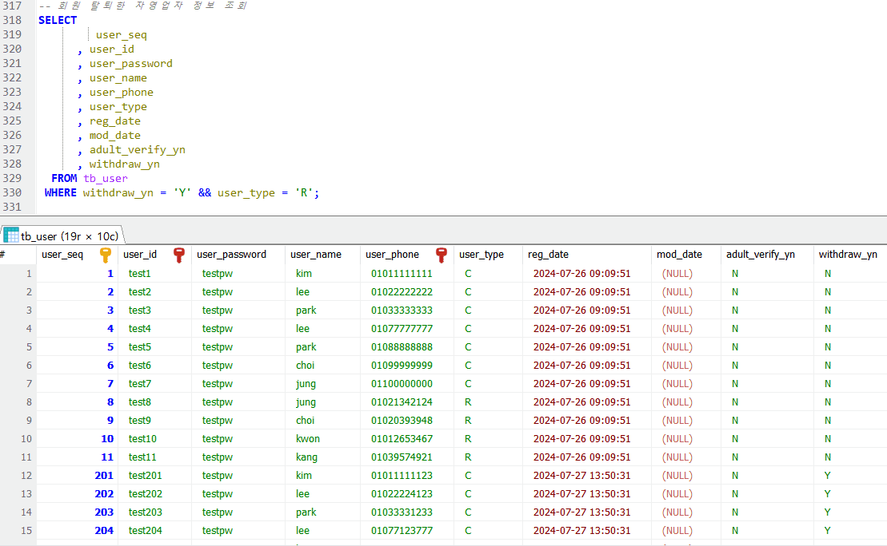
        

    

    
  
        
태그관리

        

            
1. 음식점 태그 조회

            
        

        

            
2. 음식점 태그 이름 등록

            
        

        

            
3. 음식점 태그 삭제

            
        

    

    
  
        
카테고리관리

        

            
1. 모든 음식점 카테고리 조회

            
        

        

            
2. 음식점 카테고리 등록

            
        

        

            
3. 음식점 카테고리 노출 여부

            
        

    

    
  
        
음식점등록관리

        

            
1. 음식점 등록 승인

            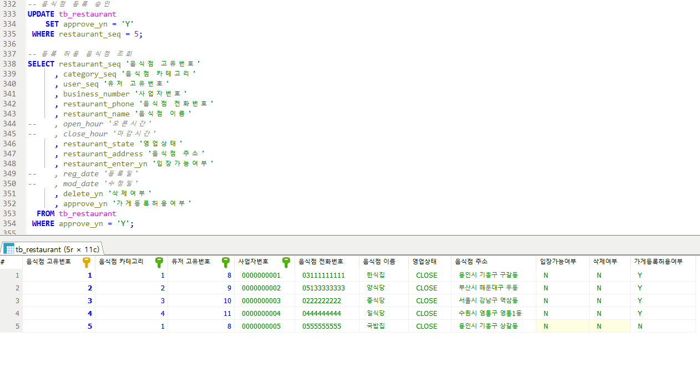
        

        

            
2. 등록 승인 음식점 조회

            
        

        

            
3. 등록 미승인 음식점 조회

            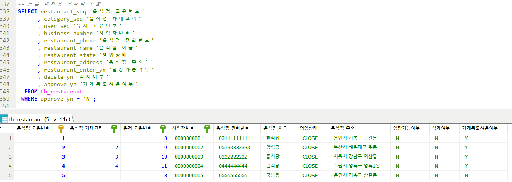
        

        

            
4.폐업처리 음식점 조회 

            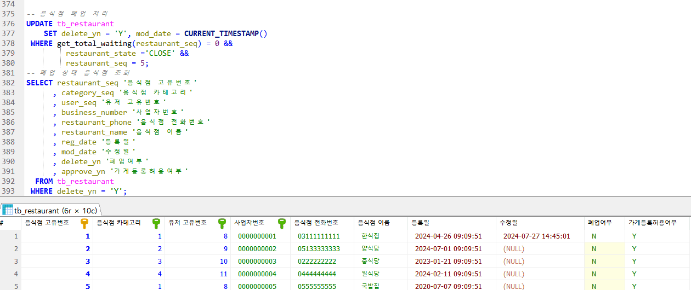
        

    

    
  
        
음식점리뷰관리

        

            
1. 삭제 요청 리뷰 조회

            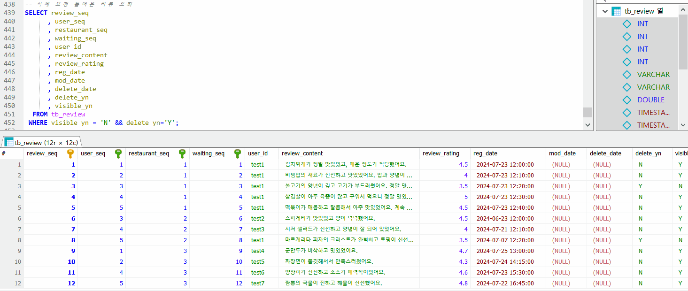
        

        

            
2. 리뷰 삭제 요청 거부

            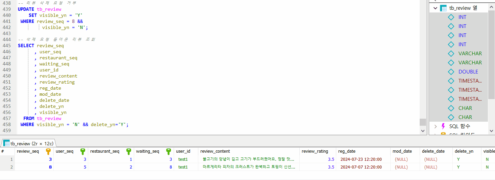
        

    

## 주요 쿼리

1.고객_웨이팅,웨이팅 알림 등록

    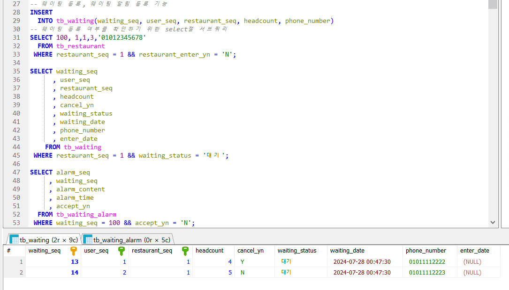

2.고객_실시간 웨이팅순 가게조회

    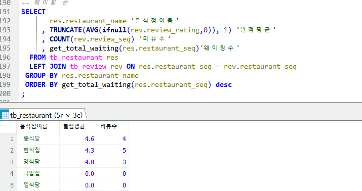

3.고객_웨이팅 확정 확인 후 리뷰작성

    

4.자영업자_웨이팅 예상 대기시간 확인

    

5.자영업자_웨이팅 목록 조회

    

6.자영업자_메뉴등록

    

## 🏁회고록

| 팀 원 | 회고록                                                                                                                                                                                                                                                                                                                                                                                                                                                                                                                                                  |
| --- |------------------------------------------------------------------------------------------------------------------------------------------------------------------------------------------------------------------------------------------------------------------------------------------------------------------------------------------------------------------------------------------------------------------------------------------------------------------------------------------------------------------------------------------------------|
| 정의진 | 프로젝트의 기획 단계부터 DB구현, 서버 구축, 백업 관리 까지 진행하며 팀 프로젝트의 기반을 다질 수 있었습니다. 처음에는 다소 복잡한 주제 선정으로 인해 기획 단계부터 어려움이 있었지만, 팀원들의 꼼꼼한 확인과 수정 덕분에 무사히 프로젝트를 완성할 수 있습니다. 다만 DB구현만으로 모든 요구 사항을 충족시키기에는 한계가 있기에 다들 고민이 많았습니다. DB로 구현할 수 있는 기능의 한계를 극복하기 위해 다들 노력을 많이 했고 이에 따라 좋은 결과가 나온 것 같습니다. 이번 프로젝트를 통해 SQL작성 능력을 키우고 프로젝트 기획 단계의 역량을 기를 수 있었습니다. |
| 전아영 | 이번 프로젝트를 진행하면서 데이터베이스만 사용해 쿼리를 짜고 테스트를 하며, 쿼리에서의 예외 처리에 대해 깊게 고민할 수 있었던 점이 좋았습니다.  하지만, 쿼리만으로 예외를 처리하는 것에 한계가 있어 테이블의 수정이 잦았습니다. 또, 테스트 케이스에서 누락된 부분도 많고 특히 회원 탈퇴 기능에 대해 아쉬운 점이 많았습니다.  이번 프로젝트를 기반으로 다음 프로젝트에서는 처음 기능을 만들 때 기능의 역할이나 필요성에 대해 꼼꼼히 분석하고 구조화해서 문서보다는 쿼리의 성능에 대해 고민할 수 있는 시간을 늘리고 싶다는 생각을 했습니다. |
| 이성민 | 이번 기반기술 프로젝트를 진행하면서 특히 외래키 제약 조건에 대해 깊이 이해할 수 있는 기회를 가졌습니다.  초기에는 이러한 제약 조건을 설계하고 구현하는 과정이 복잡하고 까다롭게 느껴졌지만, 프로젝트를 진행하며 점점 익숙해졌습니다.  또한, 이번 프로젝트는 UI 없이 백엔드와 데이터베이스만으로 시스템을 구현하는 작업이라 UI가 없는 상태에서의 데이터 처리와 시스템 동작을 이해하고 검증하는 것이 생각보다 훨씬 어려웠습니다.하지만 이러한 어려움에도 불구하고, 팀원들과 함께 프로젝트를 진행한 덕분에 포기하지 않고 끝까지 해결할 수 있었습니다.  이 과정에서 팀워크의 중요성을 다시 한 번 느꼈고, 서로의 강점을 활용하여 프로젝트를 성공적 완성 했습니다.                                                                                                                                                              |
| 이창윤 | 이번 프로젝트를 통해 프로젝트의 진행에 있어 문서화가 매우 중요한 부분을 차지한다는 것을 깨달았습니다. 계획을 세우는 단계에서부터 많은 고민과 대화가 이루어져야 한다는 것을 배웠고, 프로젝트를 진행하는 과정 속에서 서로의 역할을 인지하고 병합하는 과정이 생각보다 더 많이 이루어져야 했다는 것도 느꼈습니다. SQL 문법을 익히는 것과 문법을 활용하여 프로젝트에 대입하는 것은 전혀 다른 분야의 공부였으며, 이 프로젝트를 통해 서로의 부족함을 채워가며 다양한 고민과 방법을 찾는 과정이 저에게 소중한 경험이었습니다. 팀원의 출중한 실력보다 서로간의 배려와 인정하는 자세에서 팀프로젝트의 깊은 의미를 배웠습니다. 다양한 사람들과 함께 배운 내용을 토대로 서로 알려주고 배우는 과정에서 저는 한 층도 성장하였고 다음 프로젝트에서 부족함을 채워서 더 자신감있게 임할 수 있을 것입니다. 모두의 역할이 중요했으며, 서로의 이해심이 지금의 프로젝트를 완성시켰다고 생각합니다. 이번 프로젝트는 잊지 못할 경험이었고 늘 상시시키며 성장하는 백엔드 개발자가 되도록 하겠습니다. |
| 박상현 | 이론에서 이해하지 못한 부분이나 '왜 이런식으로 하지' 라는 의문이 있던 부분들, 연습 문제를 풀 때 주어진 데이터에서 select 문으로 정보만 가져오는 연습만 하다가 실제로 DB로 구현해보니 더 많은 도움이 되었고, DB 설계를 하면서 처음에 모델링 하는게 얼마나 중요한지 알 수 있는 계기가 되었다.  처음에 완벽하게 모델링 하지 못해서 컬럼을 설정하거나 데이터를 추가할 때, 다시 처음으로 돌아와서 모델링을 수정하는 과정에서 시간을 많이 쓰게 된 것 같아서 모델링이 얼마나 중요하고 서로의 상간 관계를 꼼꼼하게 해야 된다는 것을 배울 수 있었다. 개발자는 개발만 잘해야 하는 것이 아니라 문서화 작업까지도 잘하면 더 큰 도움이 될 수 있다는 걸 느낄 수 있었다. 또한 팀으로 프로젝트를 진행하면서 모르는 부분이나 부족한 부분을 채워 줄 수 있어서 좋았다. 팀원이 6명으로 여러가지 의견 충돌이 있을 줄 알았으나, 문제 없이 금방 의견을 추합 할 수 있었다.  아직 내 역량이 부족하고 어려운 부분이 있었지만 앞으로 더 발전하도록 노력해야겠다. |
| 남가람 | 여러 어려움에도 불구하고 이번 프로젝트를 통해 많은 것을 배울 수 있었습니다. 특히 쿼리를 작성할때 프로시저 구현으로 경험을 쌓으며 기술적으로 성장할 수 있었습니다. 비록 처음 요구사항과 모델링이 완벽하지 못해서 프로젝트 후반까지 테이블 구조를 여러 차례 수정해야 했지만, 이를 통해 모델링의 중요성을 깊이 깨닫게 되었습니다. 또한, 화면 구현이 없었기 때문에 처음 요구사항을 화면 단위로 생각하고 쿼리 구현을 사용자 단위로 나누면서, 비슷한 기능을 여러 팀원이 나누게 되어 수정이 발생할 때마다 다른 팀원들에게 영향이 미친 점은 아쉬웠습니다. 다음 프로젝트에서는 이러한 점을 개선하여 더 완벽한 요구사항과 모델링을 구현하고 싶습니다. 사실 처음의 주제를 변경하게 되면서 많은 고민이 있었지만, 다행히도 좋은 팀원들을 만나 부족한 부분을 서로 보완하며 프로젝트를 성공적으로 마칠 수 있었습니다. 이번 프로젝트를 통해 느낀 점과 배운 점을 바탕으로 앞으로 더 나은 성과를 낼 수 있을 것 같습니다. 팀워크의 중요성을 다시 한번 깨달을 수 있었고, 함께 노력하며 성장할 수 있었던 팀원들에게 감사드립니다. |

